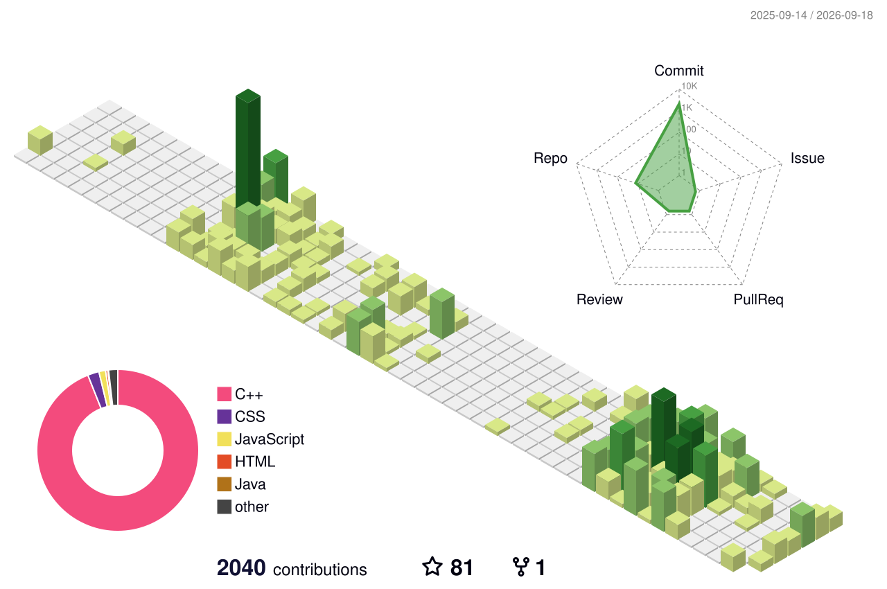

<div align="center">

# 👋 Hi, I'm Vivek Boyina

### `Software Developer` · `Computer Science Student` · `Builder`


<br/>

<a href="https://github.com/vivekboyina">
  
</a>
<a href="https://www.codechef.com/users/vivekboyina">
  
</a>

</div>

---

## 👨‍💻 About Me

```text
╭──────────────────────────────────────────────────────────────╮
│  > whoami                                                     │
│                                                              │
│  Vivek Boyina                                                │
│  Computer Science Student                                    │
│  Software Developer                                          │
│                                                              │
│  > currently                                                  │
│    ├── Building practical applications                       │
│    ├── Improving Data Structures & Algorithms                 │
│    ├── Exploring AI / ML                                      │
│    └── Learning by shipping projects                          │
│                                                              │
│  > philosophy                                                 │
│    Build → Break → Debug → Learn → Build Better              │
╰──────────────────────────────────────────────────────────────╯
```

---

## 🛠️ Tech Stack

<div align="center">

### Languages


### Development


### AI / ML


</div>

---

# 📊 GitHub Activity

## 🧊 3D Contribution Calendar

> Generated automatically from my real GitHub contribution history.

<div align="center">



</div>

## 🐍 Contribution Snake

<div align="center">

<picture>
  <source media="(prefers-color-scheme: dark)" srcset="./profile-3d-contrib/github-contribution-snake-dark.svg">
  <source media="(prefers-color-scheme: light)" srcset="./profile-3d-contrib/github-contribution-snake.svg">
  
</picture>

</div>

---

# 📈 Statistics

<div align="center">


<br/>


</div>

---

# 🚀 Featured Projects

| Project | Description | Stack |
|---|---|---|
| **DayFlow** | Personal productivity app with task planning and persistent personal tracking | `Web` `JavaScript` |
| **WeatherGPT** | Conversational weather experience focused on natural-language and native-language interaction | `AI` `Weather` |
| **SmartScan** | Intelligent scanning / computer-vision oriented project | `AI` `Computer Vision` |

> Project links can be added directly once the repositories are public.

---

# 🧠 DSA & Problem Solving

<div align="center">

<a href="https://www.codechef.com/users/vivekboyina">

</a>

</div>

```text
Data Structures       →  Learning
Algorithms             →  Practicing
Dynamic Programming    →  Improving
Problem Solving        →  Consistent
Competitive Programming→  Exploring
```

---

# 📚 Currently Learning

<div align="center">

`DSA` · `Dynamic Programming` · `Full Stack Development`
`AI / ML` · `System Design` · `Production-ready Projects`

</div>

---

# 🤝 Connect With Me

<div align="center">

<a href="https://github.com/vivekboyina">

</a>
<a href="https://www.codechef.com/users/vivekboyina">

</a>
<a href="https://www.linkedin.com/">

</a>

<br/><br/>

### `Code • Build • Learn • Repeat`

</div>
